<!-- ════════════════════════════  kVadrum · profile  ════════════════════════════ -->

<div align="center">


<br/><br/>

<a href="https://kemek.com"></a>
&nbsp;
<a href="https://kvadrum.com"></a>

<br/><br/>

<!-- quadrant console — four blocks, one chain -->
<a href="#q-whoami"></a>
&nbsp;
<a href="#q-work"></a>
<br/>
<a href="#q-stack"></a>
&nbsp;
<a href="#q-lab"></a>

</div>

---

<!-- ◰ ──────────────────────────────────────────────────────────────────────── -->
<a id="q-whoami" name="q-whoami"></a>
<details open>
<summary><b>&nbsp; ◰ &nbsp;&nbsp; whoami &nbsp;</b></summary>

<br/>

**The Lab** ships small, sharp tools and full-stack systems — privacy-first,
local-first, and agent-native — built with the latest agentic models and
workflows.

|   |   |
|---|---|
| 🧩 **Composable** | small cores, swappable parts, no decade-old admin UX |
| 🗃️ **Local-first** | data lives on your machine — self-custody, cloud opt-in, never assumed |
| ⛓️ **Verifiable** | sealed work ships as real hash commitments — when revealed, the math has to check out |

</details>

<!-- ◱ ──────────────────────────────────────────────────────────────────────── -->
<a id="q-work" name="q-work"></a>
<details>
<summary><b>&nbsp; ◱ &nbsp;&nbsp; the work &nbsp;</b></summary>

<br/>

**Eleven builds, committed sealed.** Each carries a real `sha256(name:salt)`
commitment, minted into this repo's history before it ever shipped. When one
ships, we publish its name and salt — and the math either checks out or it
doesn't. One revealed so far; ten still sealed. *Don't trust, verify.*



<br/>

**◆ tx 03 revealed — [`ctxlens`](https://github.com/kVadrum/ctxlens)** &nbsp;·&nbsp; `du(1)` for context windows: will your codebase fit inside the model's head? Answered fully offline. Don't take our word for it — this is the entire mechanic, in two lines you can run:

```sh
printf '%s:%s' ctxlens f375165ea3c6cd14b0fe7cc816ad7916 | sha256sum
# → 32c7744bab7e675e30cb89f48574d12b4e56f87a17e32663f6fa1ed80778b07b
#   matches the commitment sealed at tx 03, back when it was still a riddle ✓
```

<details>
<summary><sub>&nbsp;how the seals work &nbsp;·&nbsp; plain-text ledger &nbsp;</sub></summary>

<br/>

Each sealed build published `sha256("name:salt")` — a one-way fingerprint of its
name plus a secret 16-byte salt — long before it shipped. The hash proves the
name existed without revealing it; the salt makes the name un-guessable ahead of
time. To reveal, we publish the name and salt, and anyone can recompute the hash
and confirm it matches the commitment already sitting in git history.
Proof-of-existence, no blockchain required — the ledger is `git log`.

| tx | status | build | commitment |
|---|---|---|---|
| `00` | ◇ sealed | a racing game with zero art files — all math <sub>godot</sub> | `c89689fc…9eaec4` |
| `01` | ◇ sealed | a weather app that paints the sky on the GPU <sub>swift · metal</sub> | `f05f303f…51e10a` |
| `02` | ◇ sealed | a QR maker that never sees your data <sub>sveltekit</sub> | `ae75e7d5…f980f1` |
| `03` | ◆ revealed | **[ctxlens](https://github.com/kVadrum/ctxlens)** — du(1) for context windows — will it fit? | `32c7744b…78b07b` |
| `04` | ◇ sealed | chat with great minds; only their own words <sub>rag</sub> | `9a7e48ae…404e88` |
| `05` | ◇ sealed | a money app that refuses to phone home <sub>tauri · rust</sub> | `8bab1ae3…135c2e` |
| `06` | ◇ sealed | an astrolabe for the Bitcoin sky <sub>read-only</sub> | `7e5e2374…856390` |
| `07` | ◇ sealed | a tiny CMS core with swappable organs <sub>sveltekit</sub> | `cc6873e9…2e70fe` |
| `08` | ◇ sealed | be found when the search box is an LLM <sub>ai · seo</sub> | `c03cba3e…612173` |
| `09` | ◇ sealed | a test bench for an agent's guardrails <sub>mcp</sub> | `396f99d4…c1e715` |
| `10` | ◇ sealed | a notebook in the machine's own voice <sub>journal</sub> | `3004fda2…dcb512` |

</details>

<sub>mempool · a few dozen more builds pending confirmation — most stay sealed until they ship.</sub>

</details>

<!-- ◲ ──────────────────────────────────────────────────────────────────────── -->
<a id="q-stack" name="q-stack"></a>
<details>
<summary><b>&nbsp; ◲ &nbsp;&nbsp; the stack &nbsp;</b></summary>

<br/>


</details>

<!-- ◳ ──────────────────────────────────────────────────────────────────────── -->
<a id="q-lab" name="q-lab"></a>
<details>
<summary><b>&nbsp; ◳ &nbsp;&nbsp; the lab &nbsp;</b></summary>

<br/>


<br/>

**A human-in-the-loop agentic workshop.**

The pace of this technological revolution is daunting, exhilarating, and
relentless — and the Lab runs toward it, not from it. We experiment at the edge of
agentic development, bet that the frontier keeps barreling forward, and build for
whatever comes next.

</details>

---

<div align="center">
<sub>don't trust, verify — the ledger is <code>git log</code></sub>
<br/><br/>
<sub><b>kVadrum</b> &nbsp;|&nbsp; <a href="https://kemek.com">KeMeK Network</a> &nbsp;&nbsp;© 2026</sub>
</div>
