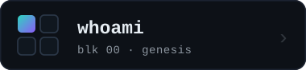
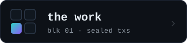
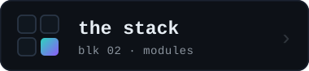
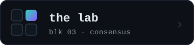

<!-- ════════════════════════════  kVadrum · profile  ════════════════════════════ -->

  

&nbsp;

  

<!-- quadrant console — four blocks, one chain -->

&nbsp;

 

&nbsp;

---

<!-- ◰ ──────────────────────────────────────────────────────────────────────── -->

<b>&nbsp; ◰ &nbsp;&nbsp; whoami &nbsp;</b>

 

**The Lab** ships small, sharp tools and full-stack systems — privacy-first,
local-first, and agent-native — built with the latest agentic models and
workflows.

|   |   |
|---|---|
| 🧩 **Composable** | small cores, swappable parts, no decade-old admin UX |
| 🗃️ **Local-first** | data lives on your machine — self-custody, cloud opt-in, never assumed |
| ⛓️ **Verifiable** | sealed work ships as real hash commitments — when revealed, the math has to check out |

<!-- ◱ ──────────────────────────────────────────────────────────────────────── -->

<b>&nbsp; ◱ &nbsp;&nbsp; the work &nbsp;</b>

 

**Eleven riddles, sealed commit-reveal style.** Every build below carries a real
`sha256(name ‖ salt)` commitment, minted into this repo's history before any
reveal. When one ships, we drop the name and the salt — and the math either
checks out or it doesn't. *Don't trust, verify.*

🏎️ &nbsp; A racing game that ships <b>without a single art file</b> — every car, curve, and shadow conjured at boot from pure math.

> `godot` &nbsp;·&nbsp; `pure-math` &nbsp;·&nbsp; no art ships 
> ◇ sealed · commitment <code>c89689fcc9ebfe295bdba086cc8487dc58fc05884cef479ee4eadce5989eaec4</code>

🌩️ &nbsp; A weather app that <b>paints the sky on the GPU</b> and hands you a <i>story</i> instead of a number.

> `swift` &nbsp;·&nbsp; `metal` &nbsp;·&nbsp; a story, not a number 
> ◇ sealed · commitment <code>f05f303f8a85140ffbd9b89ef55f13200390109517d90baf6ce136389551e10a</code>

🔗 &nbsp; A QR generator that <b>never sees your data</b> — the whole design lives inside the link itself.

> `sveltekit` &nbsp;·&nbsp; offline &nbsp;·&nbsp; it lives in the link 
> ◇ sealed · commitment <code>ae75e7d5273769e7decd63c4e8266395dfbb6ff10b4fdf80ab83852864f980f1</code>

📐 &nbsp; <code>du</code>, but for <b>context windows</b>: will your codebase fit inside the model's head? Answered fully offline.

> `typescript` &nbsp;·&nbsp; offline &nbsp;·&nbsp; counts tokens, not bytes 
> ◇ sealed · commitment <code>32c7744bab7e675e30cb89f48574d12b4e56f87a17e32663f6fa1ed80778b07b</code>

🪶 &nbsp; A conversation with history's great minds who <b>only know what they actually wrote</b> — no costume, just their corpus.

> `rag` &nbsp;·&nbsp; one corpus, no costume 
> ◇ sealed · commitment <code>9a7e48ae6d972e269dc8e5ba4386d853639fb6f4520fe34f8c2c56b829404e88</code>

🧾 &nbsp; A finance app that <b>refuses to phone home</b> — your money's story never leaves your disk.

> `tauri` &nbsp;·&nbsp; `rust` &nbsp;·&nbsp; no telemetry, ever 
> ◇ sealed · commitment <code>8bab1ae3e2d3c3cc885631801e9fddb2057bc029eb7b79afcb4c32c960135c2e</code>

🧭 &nbsp; A navigator's astrolabe for the <b>Bitcoin sky</b> — reads the network like sailors read stars; holds no coins, touches no keys.

> reads the chain &nbsp;·&nbsp; holds nothing 
> ◇ sealed · commitment <code>7e5e23743e023eb847462800cb4e386035029ffc17d244d9de9d1f217d856390</code>

🧱 &nbsp; A from-scratch answer to the 20-year-old CMS: a <b>tiny core that mounts a few dozen swappable organs</b>.

> `sveltekit` &nbsp;·&nbsp; a nucleus + its modules 
> ◇ sealed · commitment <code>cc6873e9131cfa491193252cf0dfcdd99b3312be45db91d78766e1cea22e70fe</code>

🛰️ &nbsp; Tooling for getting found in a web where the <b>search box is now a language model</b>.

> the query is a model now &nbsp;·&nbsp; be legible to it 
> ◇ sealed · commitment <code>c03cba3e8a9b6f4c8711010600d519d50b1637fa2fe1a70548581f0504612173</code>

🧪 &nbsp; A test bench for the <b>guardrails that guard the robot</b>.

> `mcp` &nbsp;·&nbsp; audit the agent's fences 
> ◇ sealed · commitment <code>396f99d4d8b08e0acd4b76abfd789add13482f7ec9602676bafb15a5d4c1e715</code>

📓 &nbsp; A public notebook written in <b>the machine's own voice</b>, about building software beside a human.

> written by the machine, about the build 
> ◇ sealed · commitment <code>3004fda2de50cf8f741c6d545337cfe143582c509d719dd41306767709dcb512</code>

 

mempool · a few dozen more builds pending confirmation — most stay sealed until they ship.

<!-- ◲ ──────────────────────────────────────────────────────────────────────── -->

<b>&nbsp; ◲ &nbsp;&nbsp; the stack &nbsp;</b>

 

<!-- ◳ ──────────────────────────────────────────────────────────────────────── -->

<b>&nbsp; ◳ &nbsp;&nbsp; the lab &nbsp;</b>

 

 

**A human-in-the-loop agentic workshop.**

The pace of this technological revolution is daunting, exhilarating, and
relentless — and the Lab runs toward it, not from it. We experiment at the edge of
agentic development, bet that the frontier keeps barreling forward, and build for
whatever comes next.

---

don't trust, verify — the ledger is <code>git log</code>
  
<b>kVadrum</b> &nbsp;|&nbsp; <a href="https://kemek.com">KeMeK Network</a> &nbsp;&nbsp;© 2026

