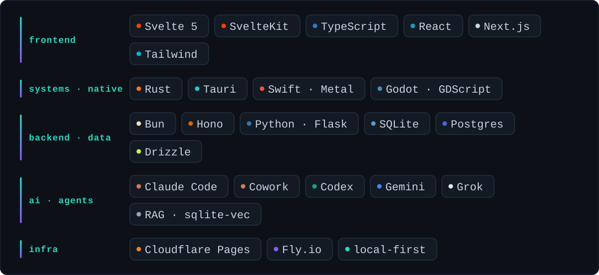
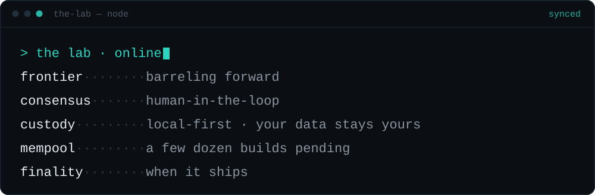

<!-- ════════════════════════════  kVadrum · profile  ════════════════════════════ -->

  

&nbsp;

  

<!-- clickable quadrant console -->
<a href="#q-whoami"><kbd> &nbsp;◰&nbsp;&nbsp; whoami &nbsp; </kbd></a>
&nbsp;
<a href="#q-work"><kbd> &nbsp;◱&nbsp;&nbsp; the work &nbsp; </kbd></a>
  
<a href="#q-stack"><kbd> &nbsp;◲&nbsp;&nbsp; the stack &nbsp; </kbd></a>
&nbsp;
<a href="#q-lab"><kbd> &nbsp;◳&nbsp;&nbsp; the lab &nbsp; </kbd></a>

---

<!-- ◰ ──────────────────────────────────────────────────────────────────────── -->

<b>&nbsp; ◰ &nbsp;&nbsp; whoami &nbsp;</b>

 

**The Lab** ships small, sharp tools and full-stack systems — privacy-first,
local-first, and agent-native — built with the latest agentic models and
workflows.

|   |   |
|---|---|
| 🧩 **Composable** | small cores, swappable parts, no decade-old admin UX |
| 🗃️ **Local-first** | data lives on your machine; the cloud is opt-in, never assumed |

<!-- ◱ ──────────────────────────────────────────────────────────────────────── -->

<b>&nbsp; ◱ &nbsp;&nbsp; the work &nbsp;</b>

 

**Ten riddles.** Names stay sealed until they ship — expand one to test your guess.

🏎️ &nbsp; A racing game that ships <b>without a single art file</b> — every car, curve, and shadow conjured at boot from pure math.

> `godot` &nbsp;·&nbsp; `pure-math` &nbsp;·&nbsp; no art ships &nbsp;&nbsp;—&nbsp;&nbsp; ◇ *sealed*

🌩️ &nbsp; A weather app that <b>paints the sky on the GPU</b> and hands you a <i>story</i> instead of a number.

> `swift` &nbsp;·&nbsp; `metal` &nbsp;·&nbsp; a story, not a number &nbsp;&nbsp;—&nbsp;&nbsp; ◇ *sealed*

🔗 &nbsp; A QR generator that <b>never sees your data</b> — the whole design lives inside the link itself.

> `sveltekit` &nbsp;·&nbsp; offline &nbsp;·&nbsp; it lives in the link &nbsp;&nbsp;—&nbsp;&nbsp; ◇ *sealed*

📐 &nbsp; <code>du</code>, but for <b>context windows</b>: will your codebase fit inside the model's head? Answered fully offline.

> `typescript` &nbsp;·&nbsp; offline &nbsp;·&nbsp; counts tokens, not bytes &nbsp;&nbsp;—&nbsp;&nbsp; ◇ *sealed*

🪶 &nbsp; A conversation with history's great minds who <b>only know what they actually wrote</b> — no costume, just their corpus.

> `rag` &nbsp;·&nbsp; one corpus, no costume &nbsp;&nbsp;—&nbsp;&nbsp; ◇ *sealed*

🧾 &nbsp; A finance app that <b>refuses to phone home</b> — your money's story never leaves your disk.

> `tauri` &nbsp;·&nbsp; `rust` &nbsp;·&nbsp; no telemetry, ever &nbsp;&nbsp;—&nbsp;&nbsp; ◇ *sealed*

🧱 &nbsp; A from-scratch answer to the 20-year-old CMS: a <b>tiny core that mounts a few dozen swappable organs</b>.

> `sveltekit` &nbsp;·&nbsp; a nucleus + its modules &nbsp;&nbsp;—&nbsp;&nbsp; ◇ *sealed*

🛰️ &nbsp; Tooling for getting found in a web where the <b>search box is now a language model</b>.

> the query is a model now &nbsp;·&nbsp; be legible to it &nbsp;&nbsp;—&nbsp;&nbsp; ◇ *sealed*

🧪 &nbsp; A test bench for the <b>guardrails that guard the robot</b>.

> `mcp` &nbsp;·&nbsp; audit the agent's fences &nbsp;&nbsp;—&nbsp;&nbsp; ◇ *sealed*

📓 &nbsp; A public notebook written in <b>the machine's own voice</b>, about building software beside a human.

> written by the machine, about the build &nbsp;&nbsp;—&nbsp;&nbsp; ◇ *sealed*

 

…and a few dozen more in the shop. Most stay private until they're ready.

<!-- ◲ ──────────────────────────────────────────────────────────────────────── -->

<b>&nbsp; ◲ &nbsp;&nbsp; the stack &nbsp;</b>

 

<!-- ◳ ──────────────────────────────────────────────────────────────────────── -->

<b>&nbsp; ◳ &nbsp;&nbsp; the lab &nbsp;</b>

 

 

**A human-in-the-loop agentic workshop.**

The pace of this technological revolution is daunting, exhilarating, and
relentless — and the Lab runs toward it, not from it. We experiment at the edge of
agentic development, bet that the frontier keeps barreling forward, and build for
whatever comes next.

---

<b>kVadrum</b> &nbsp;|&nbsp; <a href="https://kemek.com">KeMeK Network</a> &nbsp;&nbsp;© 2026

