<!-- ════════════════════════════  kVadrum · profile  ════════════════════════════ -->

  

full-stack · systems · privacy-first · local-first · agent-native

 

&nbsp;

---

<!-- ◰ ──────────────────────────────────────────────────────────────────────── -->

<b>&nbsp; ◰ &nbsp;&nbsp; whoami &nbsp;</b>

 

**The lab** ships small, sharp tools and full-stack products, built with the
latest agentic models and workflows.

|   |   |
|---|---|
| 🧱 **Full-stack** | frontend, backend, native, and the data layer underneath |
| 🔒 **Privacy-first** | local-first by default; the cloud has to earn its place |
| 🧩 **Composable** | small cores, swappable parts, no decade-old admin UX |
| 🤖 **Agent-native** | humans *and* machines are first-class readers — built for both |

<!-- ◱ ──────────────────────────────────────────────────────────────────────── -->

<b>&nbsp; ◱ &nbsp;&nbsp; the work &nbsp;</b>

 

- 🏎️ &nbsp; A racing game that ships **without a single art file** — every car, curve, and shadow conjured at boot from pure math.
- 🌩️ &nbsp; A weather app that **paints the sky on the GPU** and hands you a *story* instead of a number.
- 🔗 &nbsp; A QR generator that **never sees your data** — the whole design lives inside the link itself.
- 📐 &nbsp; `du`, but for **context windows**: will your codebase fit inside the model's head? Answered fully offline.
- 🪶 &nbsp; A conversation with history's great minds who **only know what they actually wrote** — no costume, just their corpus.
- 🧾 &nbsp; A finance app that **refuses to phone home** — your money's story never leaves your disk.
- 🧱 &nbsp; A from-scratch answer to the 20-year-old CMS: a **tiny core that mounts a few dozen swappable organs**.
- 🛰️ &nbsp; Tooling for getting found in a web where the **search box is now a language model**.
- 🧪 &nbsp; A test bench for the **guardrails that guard the robot**.
- 📓 &nbsp; A public notebook written in **the machine's own voice**, about building software beside a human.

…and a few dozen more in the shop. Most stay private until they're ready.

<!-- ◲ ──────────────────────────────────────────────────────────────────────── -->

<b>&nbsp; ◲ &nbsp;&nbsp; the stack &nbsp;</b>

 

**Frontend** &nbsp;

**Systems & native** &nbsp;

**Backend & data** &nbsp;

**AI & agents** &nbsp;

**Infra** &nbsp;

<!-- ◳ ──────────────────────────────────────────────────────────────────────── -->

<b>&nbsp; ◳ &nbsp;&nbsp; the lab &nbsp;</b>

 

**A human-in-the-loop agentic workshop.**

Software is in the middle of its biggest shift in a generation — built *with*
intelligent agents now, not just by hand. The lab is made for that pivot: newest
models, fast-moving workflows, and a standing bet that the frontier keeps moving.
We'd rather build toward what's next than defend how it used to be done. Brave
new world — and we're here for it.

---

<b>kVadrum</b> &nbsp;|&nbsp; <a href="https://kemek.com">KeMeK Network</a> &nbsp;·&nbsp; © 2026

